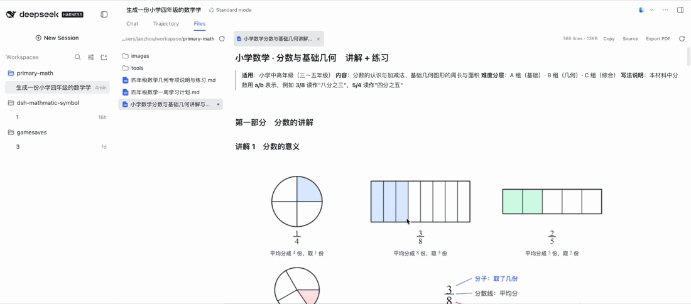

# dsh-mathmatic-symbol

[](https://www.npmjs.com/package/@jaxzhou/dsh-mathmatic-symbol)
[](LICENSE)

[English](README.md) | 中文

> npm 包名是 **`@jaxzhou/dsh-mathmatic-symbol`**。

一个 [DeepSeek Harness](https://github.com/deepseek-ai/deepseek-harness) 插件，
给 agent 四个工具：**把 LaTeX 排成图片**、**用声明式规格画数学图形**、**把公式或 SVG
转成可直接放进文档的图片**，以及**把公式与图形都插好地生成一份文档**。产物一律是
**自带字形轮廓的 SVG**（每个字形都是 `<path>`，不依赖字体）加一个可选的 **PNG**，并附带
Markdown / HTML / LaTeX 片段。

插件还会注册一段提示词指引，告诉模型**何时**该用它——当交付物是一张图片或一份文档文件，
或用户明确要求时——并且不要自己手写 SVG、LaTeX 渲染或绘图代码。装上这个插件的会话里，
生成公式图、几何图形或含它们的文档，是一次工具调用，而不是一次编程。

```sh
dsh plugin --profile web add @jaxzhou/dsh-mathmatic-symbol
dsh --profile web
```

[](media/demo.mp4)

*14 秒真实会话录屏 —— 点击可打开完整画质（3358×1480 H.264）。*

下面是插件产出的静态示例 —— 不依赖字体，也不依赖任何外部工具：


*`math_figure` 由 `examples/unit-circle.json` 生成：单位圆、$\sin\theta$/
$\cos\theta$ 投影、角度弧与 LaTeX 标题。图里没有任何一处依赖已安装的字体。*

## 目录

- [为什么要图片而不是文字](#为什么要图片而不是文字)
- [快速开始](#快速开始)
- [何时该用这些工具](#何时该用这些工具)
- [四个工具](#四个工具) · [`math_formula`](#math_formula) · [`math_figure`](#math_figure) · [`math_convert`](#math_convert) · [`math_document`](#math_document)
- [图形规格参考](#图形规格参考)
- [坐标表达式](#坐标表达式)
- [把公式与图形插进文档](#把公式与图形插进文档)
- [输出：路径、命名、布局](#输出路径命名布局)
- [嵌入文档](#嵌入文档)
- [内联预览](#内联预览)
- [配置](#配置) · [停用与卸载](#停用与卸载)
- [环境要求与验证情况](#环境要求与验证情况)
- [隐私与权限](#隐私与权限)
- [已知限制](#已知限制)
- [参与开发](#参与开发)

## 为什么要图片而不是文字

对话框里的公式是文字；到了报告、幻灯片、Word、PDF 里，它通常必须是一张图。稳定
地生产这张图，就是这个插件存在的意义：

- **不依赖字体。** MathJax 以 `fontCache: 'none'` 运行，每个字形都变成轮廓路径。
  SVG 里没有 `<defs>`、`<use>`、`id`、`font-family`——在浏览器、Word、
  `\includegraphics` 流程，以及一台没装数学字体的构建机上，渲染结果完全一致。
- **栅格化结果确定。** PNG 由 `@resvg/resvg-js` 生成，并关闭系统字体加载：每台机器
  得到同样的字节。
- **内容寻址的文件名。** 同样的输入永远写同一个文件名，重复调用只会覆盖，不会在
  工作区里堆垃圾。
- **面向文档的返回值。** 每次调用都返回 `embed.markdown_svg`、`embed.html_png`、
  `embed.latex_png`，以及按需的 base64 data URI。

代价是刻意接受的：文字被转成了轮廓，因此图片里的标签不可选中、不可搜索。

## 快速开始

**一个公式。** `math_formula` 接受裸 TeX；`$…$`、`$$…$$`、`\[…\]`、`\(…\)`、
`\begin{equation}…\end{equation}` 都会被自动剥掉。

```
math_formula({ latex: "\\int_0^\\infty e^{-x^2}\\,dx = \\frac{\\sqrt{\\pi}}{2}" })
```

→ 写出 `math/formula-f091edca9660.svg` 与 `math/formula-f091edca9660.png`，并返回
路径、尺寸与片段（下面省略了较长的 alt 文本）：

```text
<math kind="formula" display="true" width="148" height="55">
svg: math/formula-f091edca9660.svg (7.4 KiB, 148x55 at 1x)
png: math/formula-f091edca9660.png (8.5 KiB, 592x220)
markdown: 
html: 
latex: \includegraphics[width=3.92cm]{math/formula-f091edca9660.png}
</math>
```

片段一律按 **1× 显示尺寸**（148 px）给出，因此 4× 的 PNG 是同一个版式盒子的高清素
材，而不是一张放大 4 倍的图。

**一个图形。** `math_figure` 接受数学坐标下的 JSON 规格，支持点名与 LaTeX 标签：

```
math_figure({ figure: { …见 examples/triangle.json… }, name: "triangle" })
```

上面例子背后的规格在 [`examples/triangle.json`](examples/triangle.json)：带直角
标记、角度标签、网格与坐标轴的直角三角形。

```json
{
  "width": 420, "height": 320,
  "xRange": [-1, 5], "yRange": [-1, 4],
  "axes": true, "grid": true, "aspect": "equal",
  "vars": { "a": 3, "b": "2 * a" },
  "elements": [
    { "type": "polygon", "points": [[0, 0], [4, 0], [0, "a"]], "fill": "#93c5fd", "fill_opacity": 0.25 },
    { "type": "point", "at": [0, 0], "label": "A", "label_offset": [-14, 12] },
    { "type": "point", "at": [4, 0], "label": "B", "label_offset": [14, 12] },
    { "type": "point", "at": [0, "a"], "label": "C", "label_offset": [-14, -12] },
    { "type": "segment", "from": "A", "to": "B", "label": "c", "label_offset": [0, 14] },
    { "type": "angle", "at": "B", "from": "A", "to": "C", "label": "\\beta" },
    { "type": "angle", "at": "A", "from": "B", "to": "C", "right": true }
  ]
}
```

更多可直接渲染的规格：[`examples/unit-circle.json`](examples/unit-circle.json)、
[`examples/rose.json`](examples/rose.json)（三瓣玫瑰线）、
[`examples/function-plot.json`](examples/function-plot.json)（`stretch` 比例的
函数图像）。

**一份文档。** `math_document` 负责渲染公式与图形并**替你插好**——不用编路径，也不用拼
标记：

```
math_document({
  path: "docs/report.md",
  body: "# 圆盘面积\n\n半径 $r$ 的面积为 $A=\\pi r^2$。\n\n$$A = \\int_0^1 2\\pi r\\,dr$$\n\n[[figure:triangle]]\n",
  math: "image",
  figures: { triangle: { /* 一份 math_figure 规格 */ } }
})
```

→ 写出 `docs/report.md` 与 `docs/report-assets/*.svg|png`，且每张图都按**相对文档**的路径
引用：

```text
<document format="markdown" path="docs/report.md" bytes="262" math="image" self_contained="false">
assets: docs/report-assets (4 images)
  $A=\pi r^2$ → docs/report-assets/formula-83490f278b73.svg (73x32)
  $r$ → docs/report-assets/formula-86965ab96917.svg (32x32)
  $$A = \int_0^1 2\pi r\,dr$$ → docs/report-assets/formula-65e3b2edd39f.svg (118x56)
  [[figure:triangle]] → docs/report-assets/triangle-7f4ecb6f5507.svg (300x240)
</document>
```

**一次转换。** `math_convert` 处理另外几个工具覆盖不到的情况：已有的 SVG 字符串，
或工作区里已有的 SVG/PNG 文件。

```
math_convert({ source: { path: "diagrams/flow.svg" }, format: "png", scale: 3 })
```

外部 SVG 会先被清洗：脚本、外来标记、事件处理器、`DOCTYPE`、外部引用、远程
paint 与会发起请求的样式全部移除，且每一处移除都会写进 `warnings`。

## 不启动 Harness 也能试

绘图层就是普通的库调用，所以在源码检出里可以直接预览一份规格：

```sh
npm install
node scripts/render-example.mjs examples/rose.json          # 写出 .tmp/examples/rose.{svg,png}
node scripts/render-example.mjs examples/triangle.json out --scale=2
```

## 何时该用这些工具

工具描述说的是「能做什么」，但拦不住模型自己写 SVG、调绘图库或凭空编图片路径。所以插件
还注册了一段有序的系统提示词段落（`tool:math-symbol`，位于 `TOOL_REPORT` 位置），把触发
条件和边界讲清楚：

> 数学与图形：当公式或几何／函数图形需要以**图片**形式出现，或交付物是一份内嵌这些图片
> 的文档（或者用户明确要求）时，使用这些工具，而不是自己写渲染代码……每次调用都会把图片
> 写进会话工作区、按内容命名，并返回路径与可直接粘贴的 Markdown/HTML/LaTeX 片段——直接用
> 工具返回的内容；不要自己推路径、重新编码图片，或用 SVG、LaTeX 工具链、绘图库重新实现
> 渲染。普通对话回答仍然直接使用 LaTeX 文本；这些工具面向图片或文档交付物。

两点值得注意：

- **按需，而不是总是。** 只是提到公式的回答仍然用 LaTeX 文本；当交付物是图片或文档文件时
  工具才登场。
- **会自我收敛。** 该段落在每次组装时按**当前可见**的工具生成，一个都不可见时返回空字符串，
  因此限制或隐藏工具的同时也隐藏了「去用它」的指令。

它通过 `ctx.inject(['systemPrompt'], …)` 注册：没有系统提示词的组合仍然能拿到工具，只是少了
这段指引。

## 四个工具

| 工具 | 做什么 | 典型说法 |
|---|---|---|
| **`math_formula`** | LaTeX 公式 → SVG + PNG 图片文件 | “把这个公式做成图片放进文档” |
| **`math_figure`** | 声明式几何／函数图形 → SVG + PNG | “画个单位圆／三角形／玫瑰线” |
| **`math_convert`** | 已有公式／SVG 字符串／工作区 SVG/PNG 文件 → 可嵌入图片 | “把这段 SVG 转成 PNG” |
| **`math_document`** | 把公式与图形都渲染并插好，生成 Markdown/HTML/LaTeX 文档 | “把这些写成一个带图的文档” |

四者共享[公共参数](#公共参数)，并返回结构化结果。

### `math_formula`

| 参数 | 类型 | 默认 | 说明 |
| --- | --- | --- | --- |
| `latex` | string，**必填** | — | TeX 数学源码；外围定界符会被自动剥掉。上限 20 000 字符。 |
| `display` | boolean | `true` | 行间样式（算符上下限、大号分式）还是行内样式。 |
| `font_size` | number | 配置 `fontSize`（16） | 每个 em 的像素数；6–96。 |
| `color` | string | 配置 `color`（`#000000`） | 扁平 CSS 颜色：`#111827`、`navy`、`rgb(17,24,39)`。 |
| *公共* | | | `format`、`scale`、`background`、`padding`、`path`、`name`、`data_uri`、`preview`。 |

TeX 语法错误不会抛异常：MathJax 的错误标记会画进图片，结果里带一条 warning。

### `math_figure`

| 参数 | 类型 | 默认 | 说明 |
| --- | --- | --- | --- |
| `figure` | object，**必填** | — | [图形规格](#图形规格参考)。 |
| *公共* | | | 同上（规格内的 `background`/`padding` 优先于参数）。 |

### `math_convert`

| 参数 | 类型 | 默认 | 说明 |
| --- | --- | --- | --- |
| `source` | object，**必填** | — | `{latex, display?}`、`{svg}`、`{path}`（`.svg` 或 `.png`）三者取其一。 |
| `font_size` | number | 配置 `fontSize`（16） | 仅对 `latex` 源有效。 |
| `color` | string | 配置 `color` | 仅对 `latex` 源有效。 |
| *公共* | | | 同上。 |

PNG 源是直通（不重新编码）：结果指向已有文件，并给出它的嵌入片段。

### `math_document`

| 参数 | 类型 | 默认 | 说明 |
| --- | --- | --- | --- |
| `path` | string，**必填** | — | 工作区相对的文档路径。缺少扩展名时会按 `format` 补上；已有扩展名则必须与 `format` 一致。 |
| `body` | string，**必填** | — | 目标语法的正文，可使用 `$…$`、`$$…$$`、`\$` 与 `[[figure:name]]`。 |
| `format` | `markdown` \| `html` \| `latex` | `markdown` | 语法与输出扩展名。 |
| `title` | string | — | HTML 的 `<title>`；Markdown 在正文没有标题时补一个 `# `；LaTeX 生成 `\section*`。 |
| `math` | `native` \| `image` | `native` | `native` 保留公式标记交给渲染器排版；`image` 把每个公式换成渲染好的图片。 |
| `image_format` | `svg` \| `png` \| `both` | `both` | Markdown/HTML 引用 SVG，LaTeX 引用 PNG。 |
| `figures` | object | `{}` | 占位名 → `math_figure` 规格 的映射；只渲染被引用到的图形。 |
| `assets_dir` | string | 文档旁的 `<文档名>-assets` | 生成图片的存放目录。 |
| `self_contained` | boolean | `false` | 把图片内联成 base64 data URI，产出单文件（不写资源文件；LaTeX 不支持）。 |
| `scale`、`background`、`color`、`font_size` | | 插件配置 | 生成图片的样式选项。 |
| `mathjax` | boolean | `true` | HTML + `math: "native"` 时插入 MathJax CDN 引导脚本，使 `$…$` 能排版。 |

### 公共参数

| 参数 | 类型 | 默认 | 说明 |
| --- | --- | --- | --- |
| `format` | `svg` \| `png` \| `both` | `both` | 选 `svg` 时完全不依赖栅格化器。 |
| `scale` | number | 配置 `scale`（4） | PNG 放大倍数；0.25–16。像素尺寸 = CSS 尺寸 × scale。 |
| `background` | string | 配置 `background`（`transparent`） | `transparent` 或扁平颜色；同时作用于 PNG 与 SVG。 |
| `padding` | integer | 配置 `padding`（8） | 1× 下的透明留白像素；0–128。 |
| `path` | string | `math/` + 内容哈希 | 文件名（`.svg`/`.png`）或目录，工作区相对路径。 |
| `name` | string | 内容哈希 | 可读的文件基名；会被清洗成 `[A-Za-z0-9._-]`。 |
| `data_uri` | boolean | 配置 `dataUri`（`false`） | 额外返回 `data:image/…;base64,…`。 |
| `preview` | boolean | 配置 `preview`（`false`） | 模型支持图片输入时，把 PNG 附加到本次结果里。 |

未知参数会连同支持列表一起报错；拼错的字段不会被悄悄忽略。

## 图形规格参考

`figure` 对象的顶层字段：

| 字段 | 类型 | 默认 | 说明 |
| --- | --- | --- | --- |
| `width`、`height` | integer | `480`、`360` | 画布像素；40–4000。 |
| `padding` | integer | 参数 `padding`（8） | 图形四周的透明留白。 |
| `background` | string | 参数 `background` | `transparent` 或扁平颜色。 |
| `xRange`、`yRange` | `[min, max]` | 由元素自动适配 | 显式区间优先；自动适配会加 6% 边距。 |
| `aspect` | `equal` \| `stretch` | `equal` | `equal` 保证圆还是圆（会扩宽较窄的一维，类似 matplotlib 的 `adjustable="datalim"`）；`stretch` 填满画布，宽幅函数图像用它。 |
| `vars` | object | `{}` | 具名数值；值可以是引用前面名字的表达式，如 `{"a": 3, "b": "2 * a"}`。 |
| `grid` | `true` \| `{step?, color?}` | 关 | 省略 `step` 时自动取「漂亮」步长。 |
| `axes` | `true` \| `{color?, labels?}` | 含 `curve`/`parametric`/`polar` 时开，否则关 | 坐标轴、刻度、刻度标签与 `x`/`y` 轴名。 |
| `title` | string（LaTeX） | — | 画在顶部居中。 |
| `elements` | array，**必填** | — | 最多 200 个元素，按顺序解析。 |

### 元素

一个点要么是 `[x, y]`（数字或表达式字符串），要么是**字符串——引用前面某个
`point` 元素的 `label`**，「从 A 出发的中线」这类描述因此不必手算坐标。点只能引用
在它之前定义的点。

| 元素 | 字段 |
| --- | --- |
| `point` | `at`、`label`（LaTeX）、`label_offset`（屏幕像素，y 向下，默认 `[10,-10]`）、`label_size`（14）、`size`（3）、`color`、`open` |
| `segment` | `from`、`to`、`style`（`solid`/`dashed`/`dotted`）、`arrow`（`none`/`end`/`start`/`both`）、`color`、`width`（1.6）、`label`、`label_offset`、`label_size` |
| `vector` | 等价于 `arrow` 默认为 `end` 的 `segment` |
| `line` | `through`（恰好两个点）、`extend`（`both`/`forward`/`backward`/`none`），以及 `segment` 的描边与标签字段 |
| `ray` | `from`、`through`（各一个点）、`arrow`（默认 `end`） |
| `polyline` / `polygon` | `points`、`closed`（`false` / `true`）、`fill`、`fill_opacity`（0.18）、`style`、`arrow`、`label` |
| `circle` | `center` 配 `radius` **或** `through`；`fill`、`fill_opacity`、`style`、`color`、`width` |
| `arc` | `center`、`radius`、`start`、`end`（角度，逆时针）、`arrow` |
| `angle` | `at`、`from`、`to`、`radius`（像素，默认 30）、`right`（直角小方块）、`label`、`label_size` |
| `curve` | `y`（以 `x` 为变量的表达式）、`domain`（默认 `[-5,5]`）、`samples`（400） |
| `polar` | `r`（以 `theta` 为变量的表达式）、`range`（默认 `[0, 2π]`）、`samples` |
| `parametric` | `x`、`y`（以 `t` 为变量的表达式）、`range`（默认 `[0, 2π]`）、`samples` |
| `text` | `at`、`text`（LaTeX）、`size`（14）、`color`、`anchor`（`start`/`middle`/`end`）、`valign`（`baseline`/`middle`/`top`/`bottom`）、`rotate` |

几个能省一轮返工的细节：

- **所有标签都是 LaTeX**，且处于数学模式。写 `A_1`、`\alpha`、`\frac{\pi}{2}`；
  正体文字用 `\text{…}`。
- `label_offset` 是**屏幕像素**：x 向右、y **向下**。
- `angle` 与 `arc` 的角度是**度**，正方向为数学意义的逆时针；`polar`/`parametric`
  的区间是**弧度**。
- `fill` 接受纯色或带 alpha 的十六进制色（`#93c5fd33`）；不想用 alpha 时用
  `fill_opacity`。
- 曲线在视窗边界处断开而不是裁剪，因此 `tan(x)` 的极点会形成断线，而不是画出一条
  假的竖线。
- 定义域外的采样点（如 `ln(x)` 在 `x ≤ 0`）会被跳过，并计入一条 warning。

## 坐标表达式

每个坐标、每段曲线定义都可以是表达式。求值器是手写的递归下降编译器——模型给的文本
绝不会被 `eval`——并带源码长度上限与 64 层嵌套上限。

- 运算符：`+ - * / % ^`（右结合）、括号、一元负号。
- 隐式乘法：`2x`、`3sin(x)`、`2(x+1)`、`x y`。
- 常量：`pi`（或 `π`）、`tau`、`e`、`phi`。
- 函数：`sin cos tan asin acos atan atan2 sinh cosh tanh asinh acosh atanh sqrt
  cbrt abs exp ln log log2 log10 floor ceil round trunc sign min max pow hypot mod
  gcd cot sec csc`。
- 反斜杠可用：`\sin(\pi/2)` 同样有效。
- 曲线变量：`x`（直角坐标）、`t`（参数方程）、`theta`/`θ`（极坐标）。
- 未知变量、未知函数、参数个数不对、嵌套过深都会直接报错，并指出具体位置。

## 把公式与图形插进文档

`math_document` 是「给我文件」的那个工具。让它不止是字符串拼接的有三点：

- **引用相对文档。** 资源写到 `docs/report-assets/` 后，从 `docs/report.md` 里以
  `report-assets/…` 引用，因此两者可以整体移动或一起提交。
- **插入方式与格式匹配。** Markdown 得到 ``；HTML 得到
  ``，行内公式通过 `vertical-align` 对齐基线；LaTeX 得到
  `\includegraphics[width=…cm]`——行间公式与图形包在居中环境里，行内公式则按墨迹深度
  用 `\raisebox` 抬升，公式因此落在基线上而不是飘着。
- **单文件只要一个开关。** `self_contained: true` 会把每张图内联成 base64 data URI 且
  不写资源文件：一个可以直接贴进工单、随处打开的文件。（LaTeX 会被拒绝，因为
  `\includegraphics` 需要文件。）

`math: "native"` 是默认值，也更轻：公式留给渲染器排版，只有图形变成图片。当目标环境无法
排版数学时——Word、纯文本流水线、PDF 转换——或者用户明确要公式图片时，选
`math: "image"`。HTML + 原生公式会带上 MathJax CDN 引导脚本（用 `mathjax: false` 关掉，
自己提供）。

没有任何东西会被悄悄丢掉：`[[figure:name]]` 找不到对应规格会直接报错并列出你提供的名字；
提供了却未被引用的图形会以 warning 形式报告。占位符还有两个细节：早期 0.1.1 使用的双花括号写法
`{{figure:name}}` 仍然作为输入别名被接受（但不会出现在任何提示词文本里）；名字允许字母、数字、
下划线与连字符，其它内容会原样保留为正文。

## 输出：路径、命名、布局

```text
<会话工作区>/
└── math/                             # 可用 outputDir 配置
    ├── formula-1f0c9a2b3c4d.svg      # 公式与选项的内容哈希
    ├── formula-1f0c9a2b3c4d.png
    ├── triangle.svg                  # 指定 name 时使用该名字
    └── triangle.png
```

- 相对路径按**调用会话的工作目录**解析；越界路径（包括经由符号链接祖先越界）会被
  拒绝。
- 文件以原子方式写入（同目录临时文件 + rename）。
- 结果同时给出 `svg_path`（工作区相对路径，给文档用）与 `svg_host_path`（绝对路径，
  给其它工具用），以及字节数、CSS 尺寸与像素尺寸。

## 嵌入文档

| 字段 | 形态 | 适用 |
| --- | --- | --- |
| `embed.markdown_svg` / `embed.markdown_png` | `` | GitHub、文档站、多数 Markdown 渲染器（SVG 保持清晰）。 |
| `embed.html_svg` / `embed.html_png` | `` | 需要明确版式尺寸的 HTML。 |
| `embed.latex_svg` / `embed.latex_png` | `\includegraphics[width=…cm]{…}` | LaTeX（SVG 版本需要 `svg` 宏包或改用栅格图）。 |
| `data_uri_svg` / `data_uri_png` | `data:image/…;base64,…` | 无法引用同目录文件的文档；需要 `data_uri: true`。 |

未生成的格式一律是空字符串，绝不会是过期内容。

## 内联预览

`preview: true` 时，PNG 还会作为持久图片块附加到工具结果上，Web 会话因此可以直接
内联显示。前提是当前模型声明支持图片输入**且**部署挂了持久附件存储；否则调用会降级
为一条 `warnings`，例如
`inline preview unavailable: model "…" does not declare image input`。它永远不会变成
错误，文件也始终照常写出。

## 配置

写在 profile 的 `cordis.patch.yml`（在所有 bundle 层之后应用）：

```yaml
- id: jaxzhou-mathmatic-symbol
  config:
    outputDir: math        # 产物目录（工作区相对路径）
    scale: 4               # PNG 默认放大倍数
    color: '#000000'       # 公式默认墨色
    background: transparent
    padding: 8
    fontSize: 16           # 公式一个 em 的像素数
    preview: false         # 默认是否内联预览
    dataUri: false         # 默认是否返回 data URI
    # workspaceRoot: /abs/path   # Host 侧覆盖，主要用于测试
```

配置不合法会在挂载时直接报错并指出字段名，不会被取整或忽略。

## 停用与卸载

不卸载也能关掉（`patchReload: live` 的 profile 无需重启）：

```yaml
- id: jaxzhou-mathmatic-symbol
  disabled: true
```

```sh
dsh plugin --profile web remove @jaxzhou/dsh-mathmatic-symbol
```

## 环境要求与验证情况

- **DeepSeek Harness `0.1.5-rc.2`** —— 纯 Host 插件：只要组合里有工具注册表就能用，
  `headless`、`tui`、`web` 或自定义组合均可，不需要 Web 界面。
- **Node ≥ 22.19**（Harness 声明的范围）。
- 运行时依赖：`mathjax-full@^3.2.2`（纯 JS）与 `@resvg/resvg-js@^2.6.2`（原生，仅
  PNG 需要）。

`0.1.0` 已验证的内容：

本仓库已验证的内容：

- `npm run check`：类型检查、带产物形状断言的打包构建，以及完整测试套件——逐像素的几何
  断言、按格式组装文档的断言，以及覆盖落盘文件的端到端校验。
- Harness 自带的 `assertSupportedJsonSchema` 与 `validateJsonSchemaValue` 接受全部
  **四个**输出 schema 与真实产物值。
- 以 `@deepseek-ai/dsh-base` + 本插件组合的 profile 真实启动：live registry 中出现全部
  四个工具（共 29 个工具），并且真实系统提示词里组装出了 `tool:math-symbol` 指引段落。
- 未验证：由真实 LLM 驱动的工具调用（构建环境没有配置 API key）。工具层、schema 与提示词
  段落由上述检查覆盖。

发布状态：**`0.1.2`** 是当前版本，包含全部四个工具与提示词指引。**`0.1.0`** 早于
`math_document` 与那段指引，只注册三个工具，因此请安装
`@jaxzhou/dsh-mathmatic-symbol@^0.1.1`（不带版本号的安装已经会解析到它）。

## 隐私与权限

- **只写工作区。** 输出路径按会话工作目录解析，并检查符号链接祖先。
- **不联网。** 排版、绘图、栅格化全部在本地完成；MathJax 与 resvg 是依赖，不是服务。
- **不读凭据、不落会话数据。** 唯一接触的服务是 `preview` 用到的可选
  `ctx.attachments.saveImage()`。
- **不执行模型给的代码。** 表达式走 `src/expr.ts` 的编译器；LaTeX 排除了
  `html`/`require`/`autoload` 扩展；`math_convert` 接受的 SVG 会被清洗并逐条报告
  移除项。
- **按需降级。** 平台没有预编译栅格化绑定时，调用仍然返回 SVG，并在 `warnings` 里
  说明。

## 已知限制

- **文字即轮廓。** 图片里的标签不可选中、不可搜索；这是不依赖字体的代价。
- **`math_convert` 的 PNG 只做直通。** 已有 PNG 不重新编码，也不解析 JPEG/WebP/GIF
  的尺寸；文件输入只接受 `.svg` 与 `.png`。
- **PNG 需要原生绑定。** 当前平台没有 `@resvg/resvg-js` 预编译产物时，只有 SVG。
- **`aspect: "equal"` 会调整视窗。** 两个区间都给定时，较窄的一维会被扩宽以保持
  等比例，因此坐标轴可能略微超出你给的区间；宽幅函数图像请用 `aspect: "stretch"`。
- **一次一张图。** 没有子图／多面板语法；把多个元素画在同一画布，或分多次调用。
- **无 3D、无隐函数。** 只支持平面显式函数、参数曲线与极坐标曲线。
- **默认输出目录是 `math/`。** 若你的素材放在别的树下，用 `path` 或 `outputDir` 指定。
- **文档是整体生成的。** `math_document` 每次写出完整文件并覆盖旧文件；没有增量编辑，
  对已生成文档的手工修改会在重新生成时丢失。它适合产出最终结果，不适合维护一份长期文档。
- **HTML 的原生公式会引入 CDN 脚本。** MathJax 引导来自 jsDelivr 的 `<script>`；用
  `mathjax: false` 自己提供，或用 `math: "image"` 得到完全离线的文档。
- **Markdown 里的行内公式图贴在基线上。** 只有 HTML 与 LaTeX 做了显式基线校正
  （`vertical-align`、`\raisebox`）；Markdown 渲染器自己决定图片对齐方式。

## 版本历史

| 版本 | 发布日 | 主要内容 |
| --- | --- | --- |
| `0.1.2` | 2026-09-13 | 热修：文档工具的图形占位符改为 `[[figure:name]]`。0.1.1 里的双花括号写法与系统提示词的变量插值冲突（`{{name}}` 中名字不符合 `[a-z][a-z0-9_]*` 会直接抛错），导致装有该插件的 profile 每次组装提示词都失败；旧写法仍作为输入别名被接受，并且测试套件现在会按 Harness 自身规则检查所有面向提示词的文本。 |
| `0.1.1` | 2026-09-13 | `math_document`——把公式与图形渲染并插好地生成文档；`tool:math-symbol` 提示词指引，让 agent 调用这些工具而不是自己写渲染代码；嵌入片段改为按 1× 显示尺寸给出 PNG；`examples/` 四份可渲染规格与两份 README 的完整参考。 |
| `0.1.0` | 2026-09-12 | 首个版本：`math_formula`、`math_figure`、`math_convert`，不依赖字体的 SVG 输出与共享的嵌入片段。 |

## 参与开发

构建、产物模型、依赖策略与真机验证步骤见 [CONTRIBUTING.md](CONTRIBUTING.md)，仓库
规则见 [AGENTS.md](AGENTS.md)。

```sh
npm install
npm run check        # 类型检查 + 构建 + 测试
node scripts/render-example.mjs examples/rose.json
```

## 许可证

MIT —— 见 [LICENSE](LICENSE)。
